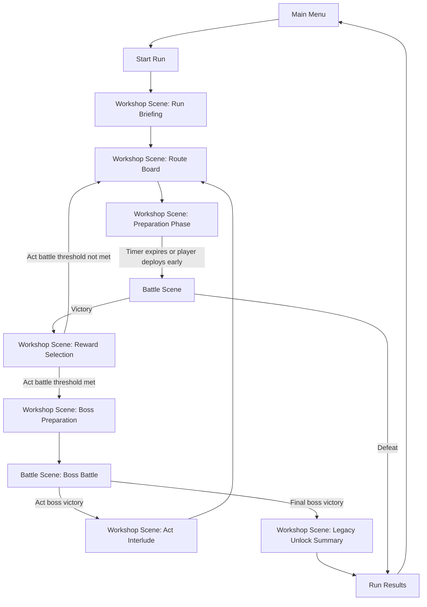
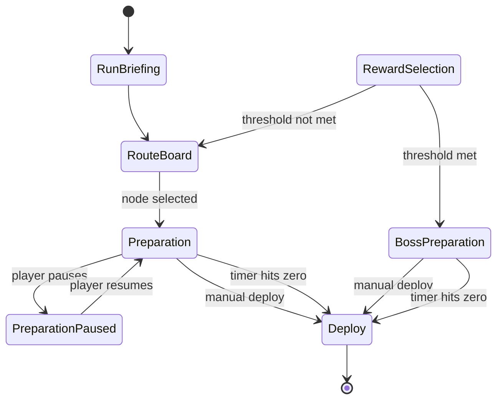

# Arcane Atelier - Game Flow And Scene Guide

**Document Type:** Flow, scene, and progression specification  
**Audience:** Gameplay Engineering, UI/UX, Technical Design, QA, Production  
**Status:** Target design aligned to the current `MainMenuScene -> WorkshopScene -> BattleScene` integration shape

---

## 1. Scene model

### 1.1 Physical scene count

Recommended production scene structure:

- `MainMenuScene`
- `WorkshopScene`
- `BattleScene`

### 1.2 Logical game states

Most game states should live inside `WorkshopScene` rather than becoming extra Unity scenes.

`WorkshopScene` state list:

- `RunBriefing`
- `RouteBoard`
- `WorkshopPreparation`
- `BossPreparation`
- `RewardSelection`
- `ActInterlude`
- `LegacyUnlockSummary`
- `RunResults`

This keeps the scene transition count low while still supporting a full run loop.

---

## 2. High-level flow chart

---

## 3. Exact transition rules

| From | To | Trigger | Data passed |
|------|----|---------|-------------|
| `MainMenuScene` | `WorkshopScene` | New Run / Continue Run | run seed, meta unlock state |
| `WorkshopScene: RouteBoard` | `WorkshopScene: WorkshopPreparation` | player selects next route node | encounter definition, prep tick budget, reward pool |
| `WorkshopScene: WorkshopPreparation` | `BattleScene` | player deploys or prep timer reaches zero | `WorkshopBattlePayload` plus encounter context |
| `BattleScene` | `WorkshopScene: RewardSelection` | normal or elite victory | `BattleResult`, reward candidates, next route unlock |
| `WorkshopScene: RewardSelection` | `WorkshopScene: BossPreparation` | act combat threshold reached | boss encounter definition, boss prep tick budget |
| `BattleScene` | `WorkshopScene: ActInterlude` | act boss victory | boss reward bundle, act progression update |
| `BattleScene` | `WorkshopScene: LegacyUnlockSummary` | final boss victory | run-end rewards, permanent unlocks |
| `BattleScene` | `WorkshopScene: RunResults` or `MainMenuScene` | defeat | run statistics, failure summary |

---

## 4. Current implementation reference

The scene names above are not invented. They come from the integration branch flow:

- `MainMenuScene`, `WorkshopScene`, and `BattleScene` are referenced in `origin/integration:Assets/ArcaneAtelier/Integration/Runtime/GameFlowRuntime.cs`
- start-game menu loading is defined in `origin/integration:Assets/ArcaneAtelier/MainMenu/MainMenuManager.cs`
- workshop-to-battle card handoff is defined by [WorkshopBattleContract.md](WorkshopBattleContract.md)

The new design keeps those names so teammates do not need to throw away the current integration path.

---

## 5. Route board design

### 5.1 Why a route board fits this game

`Slay the Spire` works because route choice creates readable risk and reward before the fight begins. Arcane Atelier needs the same readability, but it should feel like defending breach fronts, not climbing a tower.

The route board represents a set of unstable breach lines around the atelier. Each node is a place where reality is thinning.

### 5.2 Route board rules

- The player sees 2 to 3 forward connections from the current node.
- Node type and reward bias are visible before selection.
- The chosen node defines:
  - encounter pool
  - prep tick budget
  - enemy modifier set
  - reward table bias
- Elites should always be telegraphed.
- Bosses are telegraphed by an act progress meter, not by a selectable route node.

### 5.3 Node type intent

| Node type | Purpose | Prep time | Reward bias |
|-----------|---------|-----------|-------------|
| `Skirmish` | baseline progression fight | medium | balanced |
| `Elite Hunt` | high-risk challenge | short | relic/passive/factory unlock |
| `Harvest` | resource catch-up | long | spirits, materials, recipe support |
| `Sanctum` | recovery and clean-up | medium | heal, cleanse, remove drawback |
| `Anvil` | targeted upgrade | medium | machine upgrade, card family upgrade |
| `Omen` | authored event | variable | narrative choice or tradeoff |

### 5.4 Boss trigger rule

Bosses appear automatically after a fixed number of cleared combat encounters in the current act.

Recommended thresholds:

- `Act I`: `4` combat clears
- `Act II`: `5` combat clears
- `Act III`: `6` combat clears

Rules:

- only successful combat encounters count toward the threshold
- non-combat route nodes do not count
- once the threshold is reached, the next workshop return goes to `BossPreparation` instead of `RouteBoard`

Current runnable prototype behavior:

- every non-boss victory increments the current act combat clear count by `1`
- when the threshold is reached, the next preparation label becomes `Act X Boss`
- boss victories reset the act clear count and advance to the next act

---

## 6. Preparation tick system

### 6.1 Core rule

Every preparation phase has a fixed budget of **Preparation Ticks**. When the budget ends, the breach opens and battle starts automatically.

### 6.2 Player-facing behavior

- The player can pause to plan placement.
- The factory only advances while time is running.
- The player may deploy early.
- Deploying early grants a small `Initiative` bonus in battle.

### 6.3 Pressure formula

Recommended formula:

`AvailablePrepTicks = NodeBaseTicks - ActPressurePenalty - EncounterStreakPenalty + Bonuses`

Recommended starting values:

| Encounter tier | Act I | Act II | Act III |
|----------------|-------|--------|---------|
| `Skirmish` | 120 | 95 | 75 |
| `Elite Hunt` | 95 | 75 | 60 |
| `Harvest` | 140 | 120 | 100 |
| `Boss Preparation` | 150 | 125 | 105 |

Recommended per-node pressure decay inside an act:

- after each cleared combat node, reduce the next prep window by `5` to `10` ticks
- clamp minimum prep budget so encounters remain solvable

### 6.4 Why the timer matters

The timer transforms the workshop from a sandbox into a game loop:

- early acts reward experimentation
- later acts reward mastery and cleaner lines
- route choice becomes meaningful because some fights give less time to prepare

---

## 7. Workshop state machine

The `Deploy` transition commits the battle payload and loads `BattleScene`.

---

## 8. Battle return flow

After battle, the game should always return to `WorkshopScene`, then branch into one of three logical outcomes:

- `RewardSelection` after normal victory, followed by either `RouteBoard` or `BossPreparation`
- `ActInterlude` after act boss victory
- `RunResults` after defeat or final completion

This aligns with the current integration direction where battle results are already designed to be consumed when workshop reloads.

---

## 9. Battle deployment UX

The current prototype language uses a forge/commit button. For production clarity, the final UX should separate the underlying action into two explicit concepts:

- `Forge Loadout`: snapshot the prepared cards
- `Open Breach`: leave the workshop and start the encounter

If the team wants one button in the prototype, use a clearer combined label such as:

- `Forge And Deploy`

This preserves the current interaction while making the player intent obvious.

---

## 10. Failure and completion flow

### 10.1 Defeat

On defeat:

- show run stats
- show defeated-by enemy
- show deepest node reached
- show cards forged, damage dealt, healing done, total prep ticks used
- return to main menu or offer quick restart

### 10.2 Final boss victory

On final boss victory:

- show final cutscene or short story beat
- unlock one permanent legacy reward
- show new unlock preview
- return to the main menu with `Continue` replaced by post-run summary

---

## 11. QA-critical flow checks

- Starting a run always resets old workshop payload and old battle result bridge state.
- Returning from battle always restores the correct workshop-side logical state.
- The prep timer always transitions into battle even if the player does nothing.
- Rewards are granted only once.
- Boss preparation triggers only after the configured act combat threshold is met.
- Boss clears trigger both run progression and meta progression.
