# Arcane Atelier

<p align="center">
  <strong>Forge spells. Hold the breach.</strong>
</p>

<p align="center">
  Arcane Atelier is a Unity 6 prototype that fuses factory-building deck production with encounter-based card combat.
  Instead of drafting cards from rewards alone, the player manufactures the next battle deck inside a pressured magical workshop.
</p>

<p align="center">
  
  
  
  
  
  
  
</p>

<p align="center">
  
  
  
  
  
</p>

## Table of Contents

- [Overview](#overview)
- [Why This Project Is Different](#why-this-project-is-different)
- [Current Prototype Slice](#current-prototype-slice)
- [Core Loop](#core-loop)
- [Content Snapshot](#content-snapshot)
- [Visual Snapshot](#visual-snapshot)
- [Technology Stack](#technology-stack)
- [Getting Started](#getting-started)
- [Controls](#controls)
- [Architecture](#architecture)
- [Repository Map](#repository-map)
- [Documentation Guide](#documentation-guide)
- [Known Limitations](#known-limitations)
- [Near-Term Direction](#near-term-direction)

## Overview

Arcane Atelier is a hybrid game prototype built around a clear fantasy:

> you do not merely draw a battle deck, you engineer it.

The project combines two tightly connected layers:

- **Workshop**: a top-down, grid-based spell forge where elemental spirits, conduits, processors, and fusion machinery generate combat cards over time.
- **Battle**: a readable, encounter-focused card combat layer that consumes the exact payload forged in the workshop.

The intended full-run identity is a readable roguelike loop in the spirit of `Slay the Spire`, but with production-line planning as the central differentiator.

## Why This Project Is Different

Most deckbuilders ask the player to optimize decisions after the deck already exists. Arcane Atelier moves that authorship earlier in the loop.

- **Deck construction is physical**. Throughput, routing, fusion order, and time pressure determine what the player can actually bring into combat.
- **The workshop is not flavor**. It is the mechanical origin of battle power, card composition, and reward value.
- **Combat is downstream from production**. Battle does not invent a deck on its own. It resolves the tactical consequences of workshop output.
- **Scene handoff is explicit**. Workshop and Battle communicate through a bridge payload contract rather than hidden scene coupling.
- **The prototype already supports a full playable chain**. Main menu, prologue, workshop preparation, battle deployment, reward-aware return flow, and boss progression scaffolding are all present in the repo.

## Current Prototype Slice

### Workshop

The workshop is a playable runtime slice centered on production, inspection, and deployment.

Current workshop presentation and behavior:

- A wide forge grid supports multi-lane production rather than a tiny tutorial board.
- A top telemetry band exposes remaining prep ticks, flow, spell throughput, and status messaging.
- A right-side control rail handles selection details, live inventory, forged battle deck output, prep-step advance, and deployment.
- A bottom categorized palette organizes nodes by role instead of a flat debug list.
- The current UI language is dark, brass-trimmed, and battle-aligned rather than placeholder editor-gray.

Core runtime types:

- `WorkshopSceneController`
- `WorkshopSimulation`
- `WorkshopGridView`
- `WorkshopHudPresenter`
- `WorkshopContentDatabase`

### Battle

The battle module is a playable single-enemy combat prototype with a complete runtime loop and a full IMGUI HUD.

Current battle capabilities:

- Workshop payload consumption through `WorkshopBattlePayloadBridge`
- Data-driven card definition lookup by stable `CardId`
- Per-card instruction execution
- Status effect processing with authored definitions
- Intent presentation, AP economy, and enemy windup timing
- Drag-to-target card play with keyboard fallback
- Feedback layers for banners, callouts, floating numbers, and status toasts

Core runtime types:

- `BattleSceneController`
- `BattleHudPresenter`
- `BattleFeedbackPresenter`
- `BattleSimulation`
- `BattleDeckController`
- `BattleStatusEffectController`
- `BattleContentDatabase`

## Core Loop

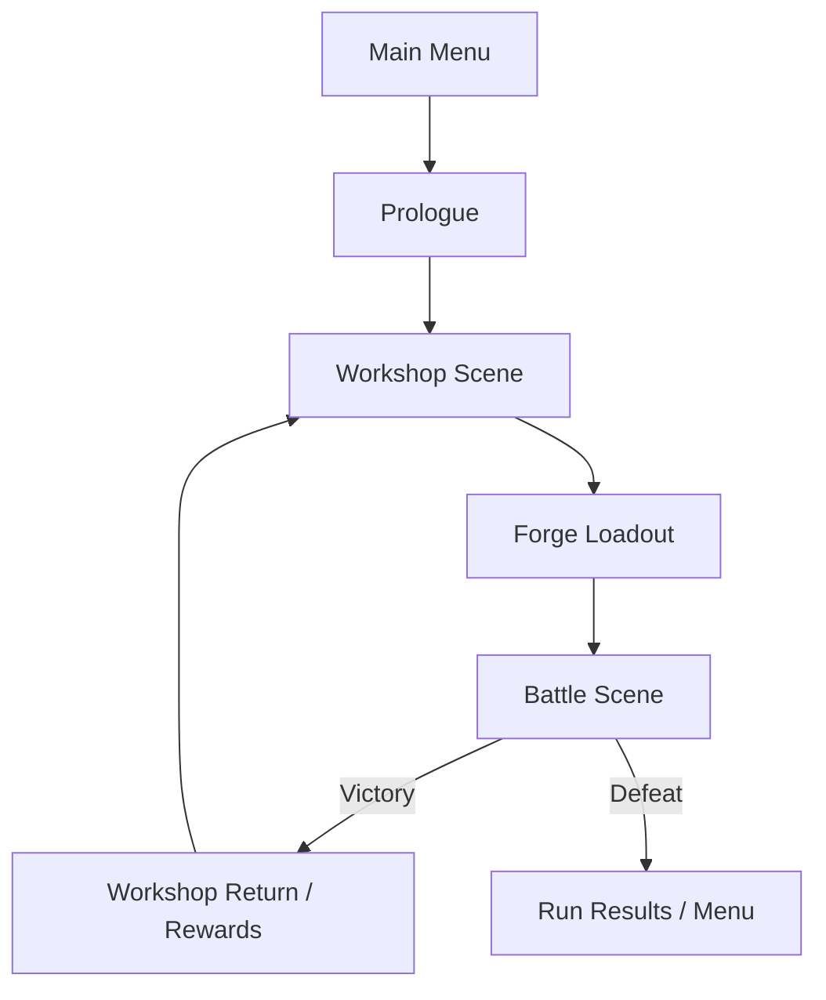

Prototype loop summary:

1. Start from the menu and move through a short prologue briefing.
2. Enter the workshop and spend preparation ticks building or refining production lines.
3. Route spirits, conduits, shaping, and fusion machines until cards reach collectors.
4. Commit the forged battle payload and deploy into battle.
5. Resolve the encounter using the produced deck, AP economy, statuses, and intent reading.
6. Return toward workshop progression and boss pacing.

## Content Snapshot

The current repository includes the following confirmed content footprint:

| Area | Current snapshot |
|------|------------------|
| Engine | Unity `6000.4.0f1` |
| UI model | IMGUI in Workshop and Battle |
| Primary scenes | `MainMenuScene`, `PrologueScene`, `WorkshopScene`, `BattleScene` |
| Encounters | `3` standard enemies + `1` boss encounter definition |
| Battle card definitions | `23` definitions total |
| Workshop-authored combat cards | `20` crafted cards across basic, intermediate, and advanced tiers |
| Runtime fallback combat cards | `3` fallback definitions |
| Status effect definitions | `16` authored definitions |
| Battle presentation profiles | `4` profile assets |
| Workshop element families | Fire, Water, Wind, Earth, Ice, Thunder, Light, Dark |
| Assembly layout | Separate runtime/editor asmdefs for Workshop and Battle |

### Encounter roster

- `Ash Imp`
- `Moss Shell`
- `Mist Leech`
- `Earth Golem`

### Element families

<p>
  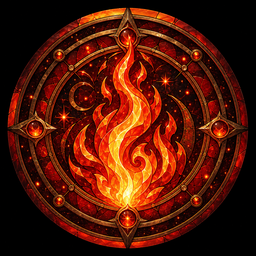
  
  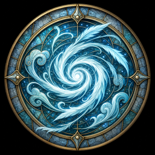
  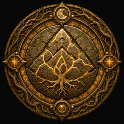
  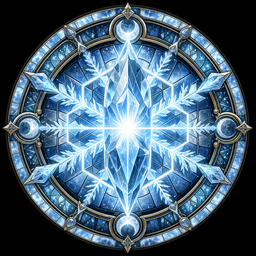
  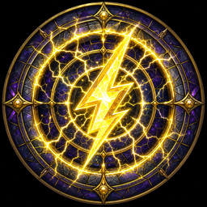
  
  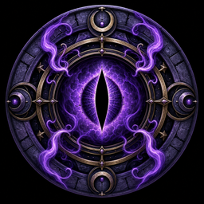
</p>

## Visual Snapshot

The current playable aesthetic is built from intentionally game-facing assets rather than anonymous debug placeholders.

### Workshop tone

- Dark workshop floor grid with brass and cobalt accenting
- Compact node sprites with readable line density for larger layouts
- Right-rail information hierarchy for inspection, inventory, and deck readout
- Bottom palette tabs for spirits, routing, core systems, and fusion tools

### Battle tone

- Encounter-specific background sprites
- Distinct enemy silhouettes for each encounter
- Animated character frame sets for player and enemies
- Readable card battlefield with intent-forward HUD layout

### Resource gallery

<p>
  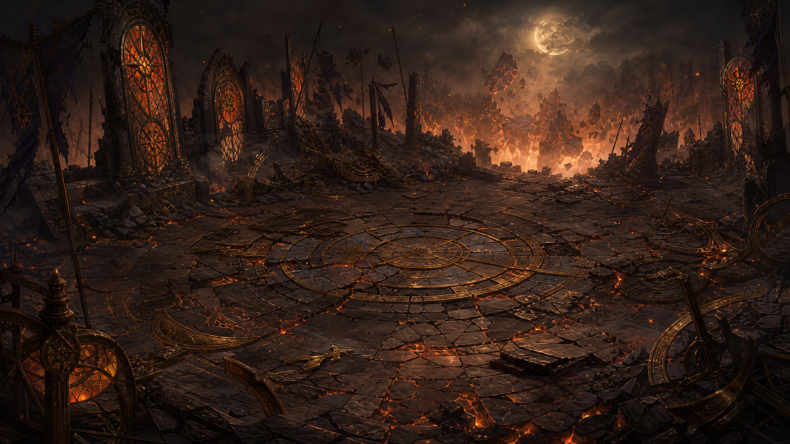
  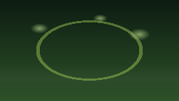
  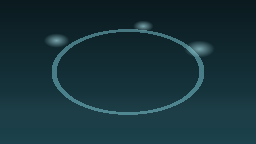
  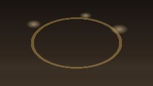
</p>

<p>
  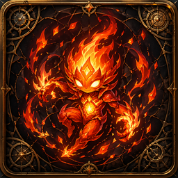
  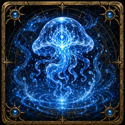
  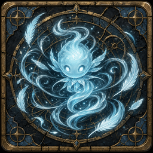
  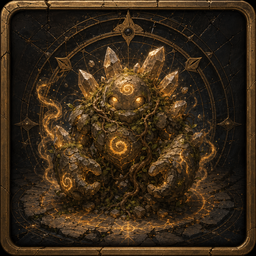
  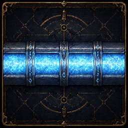
  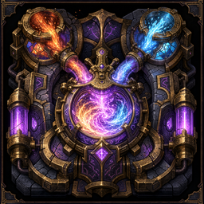
  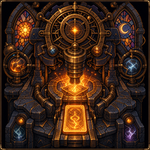
  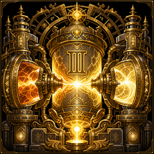
</p>

## Technology Stack

| Category | Implementation |
|----------|----------------|
| Engine | Unity 6 LTS (`6000.4.0f1`) |
| Language | C# targeting `.NET Standard 2.1` compatibility expectations |
| Render pipeline | Built-in Render Pipeline |
| UI approach | IMGUI |
| Data model | ScriptableObject-driven content databases and definition assets |
| Modularization | Assembly definition separation for runtime and editor code |
| Integration boundary | `WorkshopBattlePayloadBridge` and `BattleResultBridge` |

## Getting Started

### Recommended entry path

1. Open the repository as a Unity project in **Unity `6000.4.0f1`**.
2. Allow the initial import and script compilation to complete.
3. If workshop-generated content or scenes appear stale, run:
   - `Arcane Atelier > Workshop > Rebuild Spell Assembly Content`
4. Open:
   - `Assets/Scenes/MainMenuScene.unity`
5. Press Play.

This route gives the best representation of the current intended flow:

- `MainMenuScene` -> `PrologueScene` -> `WorkshopScene` -> `BattleScene`

### Fast iteration entry points

For targeted testing, these direct scene entries are useful:

- `Assets/Scenes/WorkshopScene.unity` for forge iteration and payload generation
- `Assets/Scenes/BattleScene.unity` for combat-side validation

### What to expect in the workshop

- The workshop starts as an active preparation scene, not a static editor mockup.
- Production lines convert elemental output into spell cards over time.
- Only cards that reach the battle deck collectors count toward deployment.
- Early deployment can preserve prep ticks and grant an opening shield bonus.

## Controls

### Main menu

- `Enter` or `Space`: start run
- `Esc`: quit

### Prologue

- `Enter` or `Space`: continue / enter workshop
- `Esc`: return to main menu

### Workshop

- `LMB`: place or select
- `Hold LMB and drag`: pan camera
- `RMB`: remove placed node or arm mirrored corner conduit variants from the palette
- `Q` / `E`: rotate placement
- `R`: rotate selected placed node
- `Space`: pause or resume workshop time
- UI actions: advance one prep tick, inspect inventory, forge and deploy

### Battle

- `Drag card to target`: primary play interaction
- `1` to `9`: keyboard play fallback by hand index
- `Space`: end turn

## Architecture

### Module boundary

```text
Workshop ──→ shared payload / enums ──→ Battle
```

Design rules:

- `Workshop` owns production, layout, inventory, and payload assembly.
- `Battle` owns encounter logic, card resolution, statuses, and result output.
- `Workshop` should not depend on battle implementation details.
- Scene handoff uses bridge objects instead of hidden hard coupling.

### Runtime ownership

| Layer | Main responsibilities |
|------|------------------------|
| Workshop runtime | grid simulation, node placement, flow, inventory, deck payload export |
| Battle runtime | encounter setup, deck hydration, AP economy, status logic, card execution |
| Integration runtime | scene flow, encounter sequencing, return-state handling |
| Editor tooling | generated content, bootstrap, authoring support |

### Assembly layout

| Assembly | Purpose |
|----------|---------|
| `ArcaneAtelier.Workshop.Runtime` | factory-building runtime systems |
| `ArcaneAtelier.Workshop.Editor` | workshop bootstrapping and editor tooling |
| `ArcaneAtelier.Battle.Runtime` | combat runtime systems |
| `ArcaneAtelier.Battle.Editor` | battle content generation and editor tools |
| `ArcaneAtelier.Battle.Editor.Tests` | minimal battle EditMode tests |

## Repository Map

| Path | Purpose |
|------|---------|
| `Assets/ArcaneAtelier/Workshop/Runtime/` | workshop runtime code |
| `Assets/ArcaneAtelier/Workshop/Editor/` | workshop generation and editor helpers |
| `Assets/ArcaneAtelier/Battle/Runtime/` | battle runtime code |
| `Assets/ArcaneAtelier/Battle/Editor/` | battle content generation and tooling |
| `Assets/ArcaneAtelier/Battle/Content/` | enemies, card definitions, status definitions, presentation profiles |
| `Assets/ArcaneAtelier/Battle/Art/` | battle sprites and backgrounds |
| `Assets/ArcaneAtelier/Art/` | workshop nodes and elemental iconography |
| `Assets/Scenes/` | recommended authored runtime scenes |
| `Documentation/` | design, flow, implementation, and combat documentation |

## Documentation Guide

For readers approaching the project from different angles:

### Start here for game-level understanding

- [Documentation/GameDesignDocument.md](Documentation/GameDesignDocument.md)
- [Documentation/GameFlowAndSceneGuide.md](Documentation/GameFlowAndSceneGuide.md)
- [Documentation/CombatRewardsAndMeta.md](Documentation/CombatRewardsAndMeta.md)

### Read these for Workshop

- [Documentation/FactoryHowToPlay.md](Documentation/FactoryHowToPlay.md)
- [Documentation/FactoryArchitecture.md](Documentation/FactoryArchitecture.md)
- [Documentation/SpellAssemblyModule.md](Documentation/SpellAssemblyModule.md)

### Read these for Battle

- [Documentation/Battle/BattleCoreArchitecture.md](Documentation/Battle/BattleCoreArchitecture.md)
- [Documentation/Battle/BattlePresentationAndInteraction.md](Documentation/Battle/BattlePresentationAndInteraction.md)
- [Documentation/BattleLogicOptimize.md](Documentation/BattleLogicOptimize.md)

### Read these for integration boundaries

- [Documentation/WorkshopBattleContract.md](Documentation/WorkshopBattleContract.md)
- [Documentation/BattleWorkshopDependencies.md](Documentation/BattleWorkshopDependencies.md)
- [Documentation/ImplementationReference.md](Documentation/ImplementationReference.md)

## Known Limitations

This repository is already playable, but it is still a prototype. Important limitations remain:

1. Battle is currently **single-enemy only**.
2. Some complex keyword behaviors still need iteration despite the status framework being in place.
3. Save/load persistence is not finalized.
4. The complete Workshop -> Battle -> Workshop reward loop is still evolving.
5. Automated coverage is present but still minimal.
6. Documentation can lag the runtime, so code and live assets should be treated as the final source of truth.

## Near-Term Direction

The current codebase is already positioned for a strong vertical-slice push:

- tighten the full run loop across menu, workshop, battle, rewards, and boss pacing
- deepen content breadth across enemies, cards, and status interactions
- continue aligning workshop presentation with the stronger battle-facing visual language
- improve test coverage around flow transitions, payload handoff, and encounter resolution
- harden save/resume and progression persistence

## Final Note

Arcane Atelier is most interesting when both halves of the design stay equally sharp:

- the **workshop** must feel like a readable production puzzle under pressure
- the **battle** must feel like the earned consequence of what the player forged

That relationship is the project.
